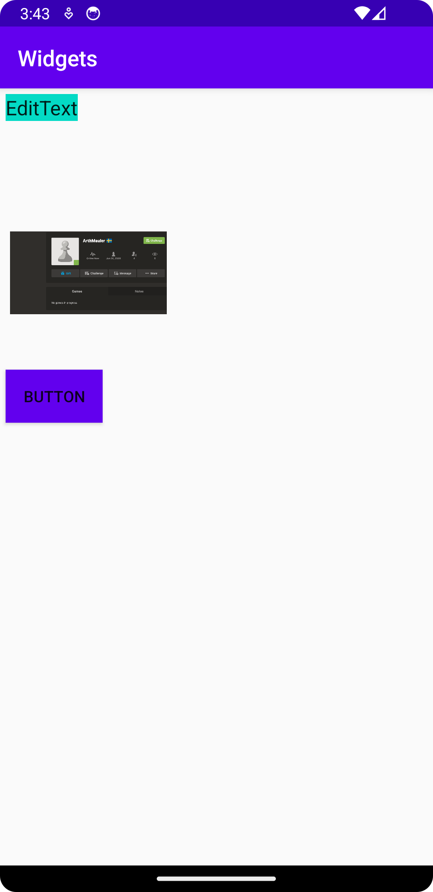

# Rapport
Lade till 3x widgets

Använde LinearLayout

Justerade position med marginTop & marginLeft 
Bytte namn och funktion för att representera rätt widgets 


Kod för överblick:
```java
        //exempel från min imageView:

        <ImageView
            android:id="@+id/myImage"
            //Liten bild men relativt jämn med andra widgets i storlek
            android:layout_width="150dp"
            android:layout_height="75dp"
            //namnger och infogar bild från drawable foldern
            android:contentDescription="arthurChess"
            android:src="@drawable/arthur"
            //ger widget en definierad plats på skärmen enligt Linear layout
            android:layout_marginLeft="5dp"
            android:layout_marginTop="100dp"
        />
```
Testade byta färg och storlek på widgets, projektet kom med redan definierade färger i color folder



